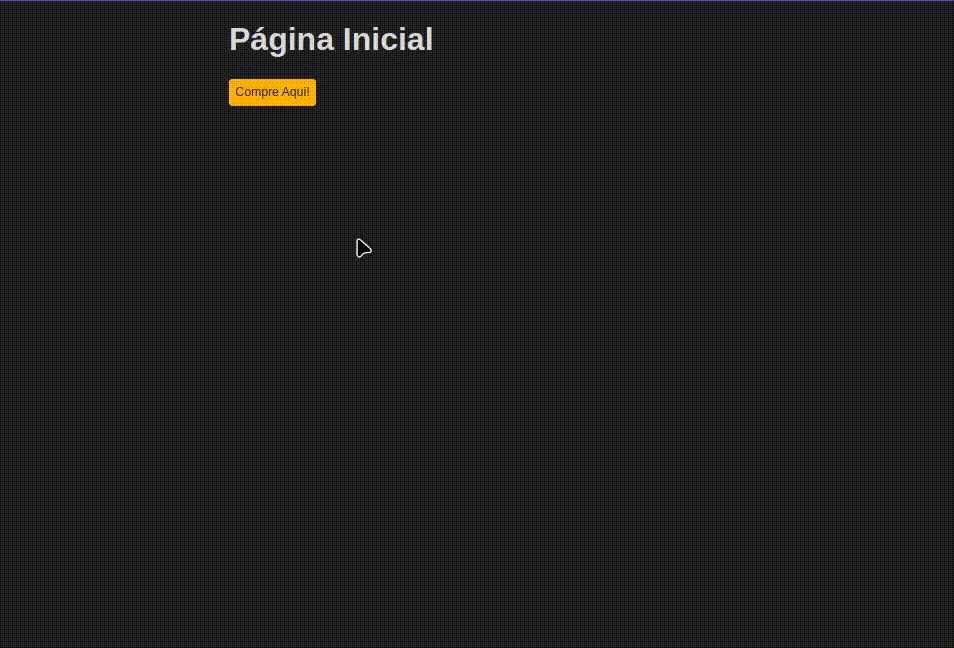
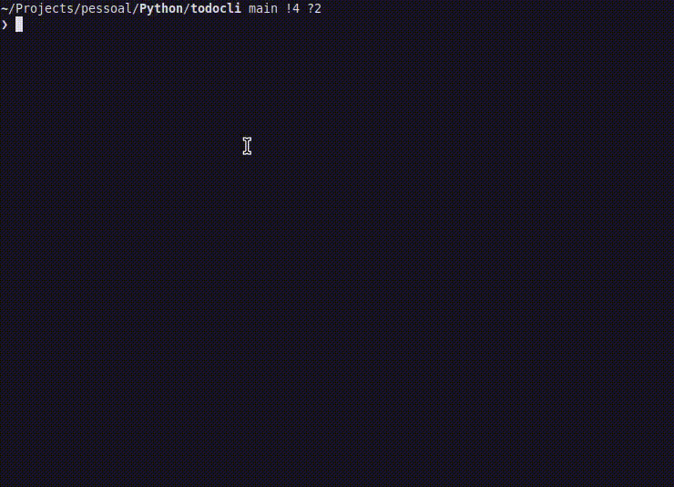

<head>
	<meta name="google-site-verification" content="Xn0i4yWSmCvO0zrKUPJNaUiXd5Nl_v00Rd6Tyrl9nJc" />
</head>

Olá, tudo bem?

Meu nome é Pablo, sou Desenvolvedor de Software focado em automatização de processos e melhoria contínua.

Para os entendedores, eu desenvolvo com as seguintes ferramentas:

	
	
	
	
	
	
	
	
    
    
    
    

---

## Alguns Projetos:

[Django E-Commerce](https://github.com/pablodeas/django_ecommerce_stripe "DjangoE-Commerce")
> E-Commerce para processar pagamentos utilizando a plataforma Stripe.

> Feito em: Django

---

[WControl](https://github.com/pablodeas/wcontrol_cli "WControl")
> Programa em linha de comando para registrar e manter controle financeiro.

> Feito em: Python, Shell Script, Docker e PostgreSQL

---

[SensorsPy](https://github.com/pablodeas/hardware-sensors "SensorsPy")
> Monitor em linha de comando para verificar a utilização de CPU, Memória RAM e Temperatura da CPU.

> Feito em: Python

---

[TodoCli](https://github.com/pablodeas/todo_cli "TodoCli")
> Programa em linha de comando para registrar tarefas.

> Feito em: Python e SQLite

---

[Backup_with_Zsh](https://github.com/pablodeas/backup_with_zsh "Backup_with_Zsh")
> Programa feito para automatizar a criação de backups e fazer upload para a cloud.

> Feito em: Shell Script, Zsh e RClone

---

[Shell_Go](https://github.com/pablodeas/shell-go "Shell_Go")
> Uma linha de comando interativa.

> Feito em: Golang

---

[FastPass](https://github.com/pablodeas/fast_pass "FastPass")
> Gerador de Senha aleatória.

> Feito em: Golang

---

## Me Encontre em:

	
	
	
	
	
	

